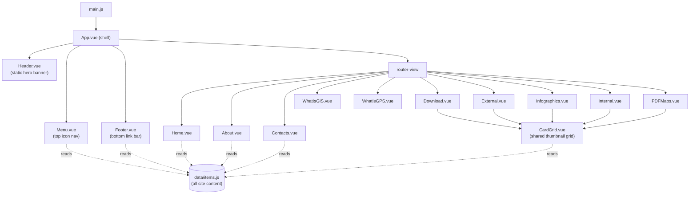

# Architecture

This document describes how the Analyze Sherman codebase is put together: the overall
architecture, the responsibility of every directory, and a description of what each
individual file does. It's the deep-dive companion to [`README.md`](./README.md) (quick
start) and [`CLAUDE.md`](./CLAUDE.md) (conventions and gotchas for anyone — human or
agent — making changes).

## Table of Contents

- [Overview](#overview)
- [Tech Stack](#tech-stack)
- [High-Level Architecture](#high-level-architecture)
- [Project Structure](#project-structure)
- [Application Bootstrap](#application-bootstrap)
- [Routing](#routing)
- [Data Layer](#data-layer)
- [Components](#components)
- [Views](#views)
- [Styling System](#styling-system)
- [Build & Tooling](#build--tooling)
- [Static Assets](#static-assets)
- [Known Dead Code / Unused Files](#known-dead-code--unused-files)

## Overview

Analyze Sherman is a **static, client-only single-page application**. There is no
backend, no API, and no database in this repository — the app's entire job is to
render a branded shell (header, nav, footer) around a set of pages that link out to
the City of Sherman's ArcGIS Online dashboards, downloadable datasets, PDF maps, and
staff contact information. Every page's content is data-driven from one hardcoded
JavaScript module (see [Data Layer](#data-layer)); there are no user accounts, forms
that submit anywhere, or writes of any kind.

## Tech Stack

| Layer | Choice | Notes |
|---|---|---|
| Framework | [Vue 3](https://vuejs.org/) | Every component uses `<script setup>` — no Options API, no mix of styles |
| Routing | [Vue Router 5](https://router.vuejs.org/) | Hash-based history (`createWebHashHistory`) — URLs look like `/#/downloads` |
| Build tool | [Vite](https://vite.dev/) | Dev server + production bundler |
| Styling | [Tailwind CSS v4](https://tailwindcss.com/) | CSS-first config via `@tailwindcss/vite` — there is no `tailwind.config.js` |
| State management | None | Removed in favor of a plain data module — see [Data Layer](#data-layer) for why |
| Package manager | npm | See `package-lock.json` |

## High-Level Architecture

Every route renders inside the same fixed shell. Most routes are themselves a thin
wrapper around one shared `CardGrid` component rather than bespoke page markup:



The key architectural decision is that **content lives in one place**
(`src/data/items.js`) and **every card-style page shares one component**
(`src/components/CardGrid.vue`). Adding a new dataset link, dashboard, or staff
contact never requires touching a view's template — only the data file. Adding a new
*kind* of page (not a card grid) means writing a new view and wiring it into the
router, same as any Vue Router app.

## Project Structure

```
shermangis/
├── index.html              # Vite entry HTML; mounts #app, loads src/main.js
├── vite.config.js          # Vite + Vue plugin + Tailwind plugin config
├── package.json            # scripts, dependencies, Node engine requirement
├── public/                 # served as-is at the site root (see Static Assets)
└── src/
    ├── main.js              # app bootstrap: creates the Vue app, installs the router
    ├── App.vue              # root component: page shell + global styles
    ├── index.css            # Tailwind entry point + brand color theme tokens
    ├── style.css            # unused (see Known Dead Code)
    ├── router/
    │   └── index.js         # route table, one entry per view
    ├── data/
    │   └── items.js         # ALL site content, as one typed array + a getItems() helper
    ├── components/
    │   ├── Header.vue       # static hero banner (not data-driven)
    │   ├── Menu.vue         # top icon nav bar (reads menuItems)
    │   ├── Footer.vue       # bottom link bar (reads footer)
    │   └── CardGrid.vue     # shared thumbnail-grid layout used by 5 views
    ├── views/
    │   ├── Home.vue          # "/" — landing page
    │   ├── About.vue         # "/about" — links to the two What-Is pages + Contacts
    │   ├── Contacts.vue      # "/contacts" — GIS staff directory
    │   ├── Download.vue      # "/downloads" — via CardGrid, type "downloads"
    │   ├── External.vue      # "/externals" — via CardGrid, type "external"
    │   ├── Infographics.vue  # "/infographics" — via CardGrid, type "infographics"
    │   ├── Internal.vue      # "/internal" — via CardGrid, type "internal"
    │   ├── PDFMaps.vue       # "/pdfmaps" — via CardGrid, type "pdfMaps"
    │   ├── WhatIsGIS.vue     # "/whatisgis" — static prose page
    │   ├── WhatIsGPS.vue     # "/whatisgps" — static prose page
    │   └── Polygons.vue      # NOT routed — dead code, see Known Dead Code
    └── assets/               # 4 image files, none currently referenced (see Known Dead Code)
```

## Application Bootstrap

**`index.html`** — the single HTML page Vite serves. Loads the favicon, sets the
`<title>`, and contains one empty `<div id="app">` plus a `<script type="module"
src="/src/main.js">`. Vue mounts entirely into that div; nothing else in this file
changes per-route (routing is client-side).

**`src/main.js`** — the bootstrap script. Creates the Vue app from `App.vue`, imports
`src/index.css` (which pulls in Tailwind), installs the router, and mounts to `#app`.
This is the only file that touches `createApp` — there used to also be a `.use(store)`
call here for Vuex, removed when the store was replaced by the plain data module.

**`src/App.vue`** — the root component and permanent page shell. Renders, in order:
`Header` → `Menu` → `<router-view>` → `Footer`, all in normal document flow (nothing
is `position: fixed`). Also owns two pieces of global, non-scoped CSS:
- `body { font-family: ... }` — deliberately an element selector, not `#app` (an ID
  selector would out-rank every Tailwind `font-serif`/`font-sans` utility class by CSS
  specificity, silently defeating any per-element font choice elsewhere in the app —
  this was a real, previously-shipped bug, see `CLAUDE.md`).
- `.page-bg` — the background image applied to `<router-view>`. Named to avoid
  colliding with the separate `Menu` component.

**`vite.config.js`** — registers the `@vitejs/plugin-vue` and `@tailwindcss/vite`
plugins. (The imported plugin-vue binding is locally named `react` in this file — a
copy-paste leftover from a template; it has no functional effect, it's just a
confusingly-named variable.)

## Routing

`src/router/index.js` creates the router with `createWebHashHistory()` (URLs are
`/#/path`, which works on any static file host with no server-side rewrite rules
needed) and a flat list of routes. Every route lazy-loads its component via a dynamic
`import()`, so each view ships as its own chunk instead of bloating the main bundle.

| Path | View | Notes |
|---|---|---|
| `/` | `Home.vue` | Landing page |
| `/about` | `About.vue` | Links to the two pages below + Contacts |
| `/contacts` | `Contacts.vue` | Staff directory |
| `/externals` | `External.vue` | "Public Maps" in the nav label |
| `/downloads` | `Download.vue` | |
| `/infographics` | `Infographics.vue` | |
| `/internal` | `Internal.vue` | Requires city credentials (external links, not gated by this app) |
| `/pdfmaps` | `PDFMaps.vue` | Nav label is "PDF Maps" |
| `/whatisgis` | `WhatIsGIS.vue` | |
| `/whatisgps` | `WhatIsGPS.vue` | |

There is no 404/catch-all route, no route guards, and no lazy-loaded route groups
beyond the per-view code splitting above.

## Data Layer

`src/data/items.js` exports two things:

- **`items`** — one flat array holding *every* piece of content in the app: dashboard
  links, dataset links, PDF map links, staff contacts, footer links, and nav menu
  entries. Every object has a `type` field that identifies which kind of content it
  is; nothing else distinguishes them structurally.
- **`getItems(type)`** — `items.filter(item => item.type === type)`. This is the only
  way any component reads content.

This is intentionally **not** a Vuex/Pinia store. The array never changes at runtime
— there's nothing to mutate, no actions, no async loading — so a plain module plus a
filter function does the whole job a reactive store would have, with far less
machinery. Every consumer wraps the call in `computed()` purely so it composes
naturally inside `<script setup>` the same way any other reactive read would:

```js
import { getItems } from '../data/items.js'
const items = computed(() => getItems('downloads'))
```

### Content types

| `type` | Consumed by | Fields | Notes |
|---|---|---|---|
| `about` | `About.vue` | `name`, `to` | Router-link targets for the About page's 3 buttons |
| `contacts` | `Contacts.vue` | `name`, `title`, `employer`, `address`, `city`, `state`, `zip`\*, `phone`, `email` | `email` already includes the `mailto:` prefix; \*one entry is missing `zip` |
| `downloads` | `Download.vue` (via `CardGrid`) | `name`, `url`, `src` | `src` is a thumbnail image URL |
| `external` | `External.vue` (via `CardGrid`) | `name`, `url`, `src` | |
| `featured` | — | `name`, `url`, `src` | Defined but **not rendered anywhere** — dead data, kept in case a future page wants it |
| `footer` | `Footer.vue` | `name`, `url`, `alt` | `alt` is defined but currently unused in the template |
| `infographics` | `Infographics.vue` (via `CardGrid`) | `name`, `url`, `src` | |
| `internal` | `Internal.vue` (via `CardGrid`) | `name`, `url`, `src` | Several entries are commented out (intentionally disabled dashboards, not dead code to delete) |
| `menuItems` | `Menu.vue` | `name`, `to`, `icon` | `to` is a router path; `icon` is an image URL, not an icon font/component |
| `pdfMaps` | `PDFMaps.vue` (via `CardGrid`) | `name`, `url`, `src` | One entry is commented out |
| `polygons` | *(nothing — see below)* | — | Referenced by `Polygons.vue` but **no items of this type exist** |

Nearly every `url`/`src`/`icon` value points at `cityofsherman.maps.arcgis.com` — the
City's own ArcGIS Online organization. Thumbnails are the default preview image
ArcGIS Online generates for that hosted item; some items have a custom thumbnail set,
others fall back to a blank placeholder (visible in the UI as an empty gray box in a
card — this is a content issue on the ArcGIS side, not something fixable from this
codebase).

**To add, edit, or remove any link, dashboard, contact, or menu entry: edit the
matching object(s) in this file.** No other file needs to change for a content-only
update. The array is organized with `/* Section */` comments matching each `type` —
add new entries under the relevant comment block.

## Components

Everything in `src/components/` is a reusable piece of the page shell or a shared
layout, as opposed to `src/views/`, which are route-level pages.

### `Header.vue`
Static hero banner shown at the top of every page (background photo of Sherman at
night, "Welcome / Analyze Sherman" text). Not data-driven — no `<script>` block at
all, since it holds no reactive state and needs none.

### `Menu.vue`
The horizontal icon nav bar directly below the header, reading the `menuItems` content
type. Each item renders as a circular icon (an image, not an icon font) with a text
label below it, wrapped in a `router-link`. Layout is `flex flex-wrap justify-center`
so the row wraps into multiple centered rows on narrow screens instead of either
squishing into one column or leaving an orphaned item pinned to one side of a partial
row (both were real bugs fixed during development — see `CLAUDE.md`).

Also defines `scrollToElement()`, a click handler bound to every nav item that looks
for an element with `id="bottom"` and scrolls to it if found. No such element
currently exists anywhere in the app, so this is a no-op today (null-guarded so it
doesn't throw); it's left in place rather than removed in case it's meant to support
a future in-page anchor.

### `Footer.vue`
The bottom link bar, reading the `footer` content type (partner site links: city,
county, appraisal district, council of governments, Esri) plus a `© {year} City of
Sherman GIS Department` line generated from `new Date().getFullYear()`. Renders as a
semantic `<footer>`/`<nav>`, with `flex-wrap` so links wrap on narrow screens.

### `CardGrid.vue`
The shared layout behind 5 of the 10 routes (`Download`, `External`, `Infographics`,
`Internal`, `PDFMaps`). Takes:

| Prop | Type | Required | Purpose |
|---|---|---|---|
| `type` | `String` | yes | Content type passed straight to `getItems()` |
| `heading` | `String` | yes | Rendered as the page's `<h1>` |
| `wrapped` | `Boolean` | no (default `false`) | Adds `min-h-screen` to the content wrapper for pages that want to guarantee at least a full viewport of height |

Plus a `#blurb` named slot for the paragraph of intro copy that follows the heading.

Renders: heading + intro paragraph, then a responsive grid of cards — one per item of
the given `type`. Each card is a single `<a>` (the whole card is clickable, not just
the image) containing a fixed 4:3 image area (`bg-gray-100` shows through for items
with no thumbnail, so a missing image reads as a deliberate placeholder rather than
collapsing to bare text) and a caption below.

The grid itself uses `grid-cols-[repeat(auto-fill,minmax(220px,1fr))]` rather than
fixed breakpoints (`sm:grid-cols-2`, etc.) — column count scales continuously with
whatever width is actually available, instead of jumping at a small number of fixed
thresholds. See `CLAUDE.md` for why this matters and the story behind it.

## Views

Route-level pages live in `src/views/`. Every route in the [routing table](#routing)
above maps to exactly one of these.

| File | Route | Data source | Description |
|---|---|---|---|
| `Home.vue` | `/` | none rendered (reads `featured`, unused) | Landing page: intro copy, two live public-facing application links with staff contacts, and 3 promo boxes (download data / "Your Place" / more public maps) linking elsewhere in the app. Has a large commented-out section (City Projects / Planned Developments) — intentionally disabled, not dead code. |
| `About.vue` | `/about` | `about` | Three buttons linking to `WhatIsGIS`, `WhatIsGPS`, and `Contacts`. |
| `Contacts.vue` | `/contacts` | `contacts` | One card per GIS staff member, each with a working `tel:` link and `mailto:` link. |
| `Download.vue` | `/downloads` | `downloads` (via `CardGrid`) | Raw GIS datasets. |
| `External.vue` | `/externals` | `external` (via `CardGrid`) | Public-facing interactive map dashboards. Nav label is "Public Maps". |
| `Infographics.vue` | `/infographics` | `infographics` (via `CardGrid`) | Demographic/community infographics (ACS, Census, Esri data). |
| `Internal.vue` | `/internal` | `internal` (via `CardGrid`) | Staff-only dashboards; the links themselves are gated by ArcGIS credentials, not by this app. |
| `PDFMaps.vue` | `/pdfmaps` | `pdfMaps` (via `CardGrid`) | Downloadable PDF maps. |
| `WhatIsGIS.vue` | `/whatisgis` | none (static) | Prose explainer + a link to Esri's "What is GIS" page. No `<script>` block. |
| `WhatIsGPS.vue` | `/whatisgps` | none (a local `links` array in-component) | Prose explainer + a short list of external GPS/surveying-standards-body links. |
| `Polygons.vue` | *(not routed)* | `polygons` (type doesn't exist) | Dead code — see [Known Dead Code](#known-dead-code--unused-files). |

## Styling System

Tailwind CSS v4, loaded via `@tailwindcss/vite` (a Vite plugin, not PostCSS
middleware) and imported once in `src/index.css` with `@import "tailwindcss"`. There
is no `tailwind.config.js` — v4 uses CSS-first configuration instead.

**Brand color tokens**: `src/index.css` defines a small `@theme` block naming the
handful of specific colors used across the site as reusable tokens rather than
one-off arbitrary hex values:

| Token | Hex | Used for |
|---|---|---|
| `brand-primary` | `#08244c` | Contact cards, "More Public Maps" box on Home |
| `brand-accent` | `#005095` | Menu icon backgrounds, footer top border, external-link accent color |
| `brand-olive` | `#676e20` | "Your Place" box on Home |
| `brand-dark` | `#383838` | "Want to download GIS data?" box on Home |
| `brand-footer` | `#4a4a4a` | Footer background |
| `brand-offwhite` | `#f8f8f8` | Light text on dark backgrounds |

These generate real Tailwind utilities (`bg-brand-primary`, `text-brand-accent`,
`border-brand-accent`, etc.) usable anywhere in the app like any built-in color.

**Responsive layout**: two different techniques are used deliberately for two
different kinds of layout decision. Structural layout changes (Home's sidebar
appearing next to the main column, a button row wrapping) use Tailwind's standard
breakpoint prefixes (`md:`, `lg:`, `2xl:`) because those are genuinely discrete
"flip" decisions. Repeating, uniform-item layouts (the `CardGrid` thumbnail grid, the
`Menu` icon row) use `auto-fill`/`auto-fit` + `minmax()` grid/flex sizing instead,
so the number of columns/items-per-row scales continuously with available width
rather than snapping at a handful of fixed breakpoints. See `CLAUDE.md` for the
reasoning and the bugs this avoided.

## Build & Tooling

```bash
npm install       # install dependencies
npm run dev       # Vite dev server with HMR
npm run build     # production build to dist/
npm run preview   # serve the production build locally
```

There is no lint, test, or type-check script configured, and no CI pipeline in this
repository. `package.json` declares an `engines.node` requirement
(`^20.19.0 || >=22.12.0`) matching what Vite 8 and `@vitejs/plugin-vue` 6 require.

## Static Assets

Two separate places hold files, and they're treated differently by Vite:

- **`public/`** — served at the site root exactly as-is, with no processing. Contains
  `favicon.svg` (referenced from `index.html`), `icons.svg` (unused), and
  `images/Hydrants.png` (referenced only from a commented-out line in
  `data/items.js`, so also currently unused).
- **`src/assets/`** — meant to be imported from component code so Vite can process/
  hash/bundle them. Currently holds 4 files (`All-In-One.png`, `Hydrants.png`,
  `vite.svg`, `vue.svg`), none of which are imported anywhere (see below).

The overwhelming majority of images in the app (thumbnails, icons, backgrounds) are
**not** local files at all — they're hot-linked URLs pointing at ArcGIS Online hosted
item content (`cityofsherman.maps.arcgis.com/sharing/rest/content/items/<id>/data`).
When adding a new card or icon, follow that existing pattern rather than importing a
local file, unless there's a specific reason to bundle an asset with the app itself.

## Known Dead Code / Unused Files

Documented here so nobody spends time investigating these as if they were bugs, and
so cleanup is a deliberate choice rather than an accident:

- **`src/views/Polygons.vue`** — not imported by the router or anything else, so Vite
  never includes it in the build. It reads `getItems('polygons')`, a `type` that
  doesn't exist anywhere in `data/items.js`, so it would render an empty list even if
  it were wired up. Left in place intentionally when discovered — ask before deleting
  or routing it, rather than assuming.
- **`src/style.css`** — a leftover from the original Vite scaffold. Not imported by
  `main.js` or anywhere else; `src/index.css` is the file that's actually live.
- **`src/assets/*`** (`All-In-One.png`, `Hydrants.png`, `vite.svg`, `vue.svg`) — none
  are imported by any component.
- **`public/icons.svg`** and **`public/images/Hydrants.png`** — not referenced by any
  live code path (the latter only appears in a commented-out data entry).
- **`Header.vue`'s `.home` CSS rule** — references
  `~@/assets/home-background.png` (a webpack-style alias that Vite doesn't resolve,
  and the file doesn't exist under that name anyway) and isn't applied to anything in
  the template regardless.
- **`data/items.js`'s `featured` type** — 4 items defined, `Home.vue` reads them into
  a computed value, but nothing in any template ever renders that computed value.
